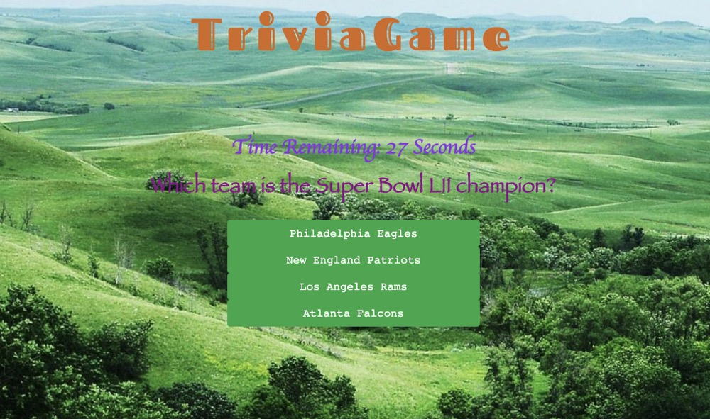
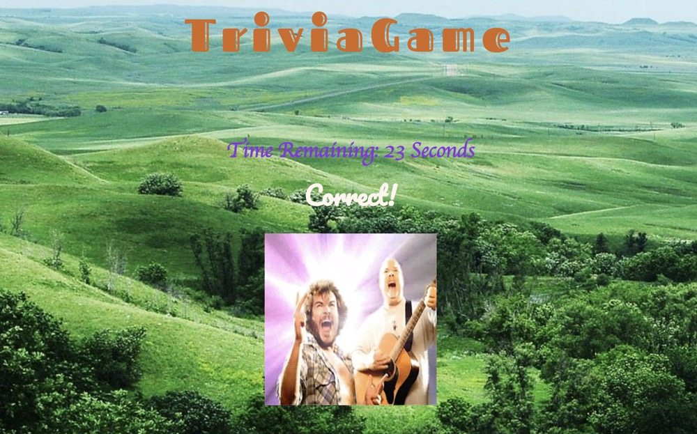

# TriviaGame

## Deployed Link

* https://easonchang15530.github.io/TriviaGame/

## Main View

* 

## Win View

* 

## App description

* Welcome to the trivia game!

* This game has a stopwatch to limit answer time and could show different gif in correct/incorrect/out of time situation. It has 5 questions and cover page and result page, but is one HTML page to display the whole game, using javascript to hide and show different information.

* This game has the same logic as quizzes or questionnaires.

## Languages/technologies/frameworks used

* JavaScript
* jQuery
* HTML
* CSS
* Timing Events
* Gifs
